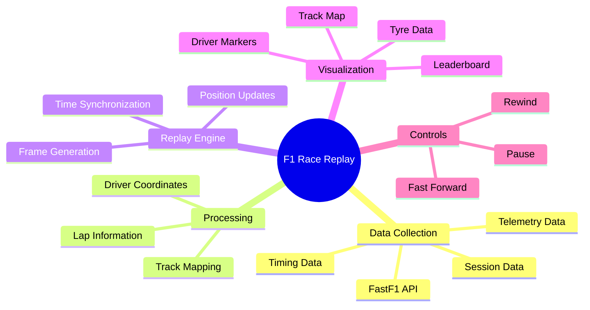
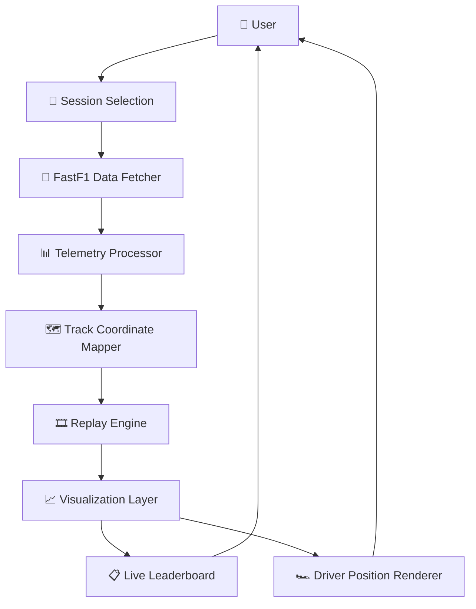
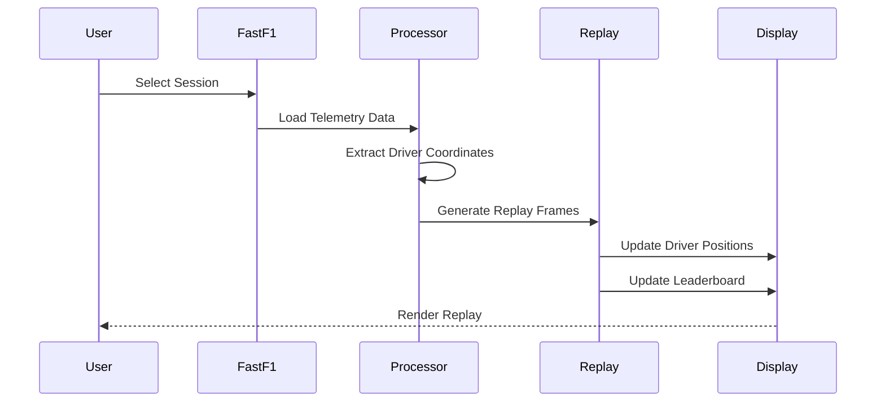
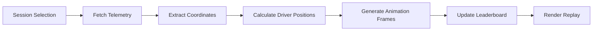

# 🏎️ F1 Race Replay


> A Python-based Formula 1 race replay simulator that visualizes real F1 telemetry and timing data. Watch every driver move around the circuit in real time while tracking positions, tyre compounds, and race progression through a live leaderboard.

---

# 🏁 Project Highlights

- 🏎️ Real Formula 1 Telemetry Visualization
- 📡 FastF1 API Integration
- 🗺️ Live Track Mapping
- 🎞️ Real-Time Replay Engine
- 📋 Dynamic Leaderboard
- 🛞 Tyre Compound Tracking
- ⏱️ Session Time Synchronization
- ⌨️ Interactive Replay Controls

---

# 🎯 Why This Project?

Formula 1 generates enormous amounts of telemetry and timing data during every session.

This project transforms raw race data into an interactive replay experience, allowing users to:

- Visualize driver movement around the circuit
- Analyze race progression in real time
- Track driver positions throughout a session
- Monitor tyre strategies and race dynamics
- Explore Formula 1 telemetry in a visual and intuitive way

---

# 🧩 Project Overview



---

# 🏗️ System Architecture



---

# 🔄 Replay Workflow



---

# 🧠 Replay Engine Pipeline



---

# ✨ Features

### 🗺️ Animated Track Map

Displays all drivers moving simultaneously around the circuit using team colours.

### 📋 Live Leaderboard

Updates race positions and tyre compounds in real time.

### ⏱️ Session Timer

Shows elapsed race or qualifying session time.

### ⌨️ Interactive Replay Controls

Pause, rewind, and fast-forward the replay.

### 🏁 Multi-Session Support

Supports:

- Race Sessions
- Qualifying Sessions
- Sprint Sessions
- Practice Sessions

---

# 🎮 Controls

| Key | Action |
|------|----------|
| Space | Pause / Resume |
| → Right Arrow | Skip Forward |
| ← Left Arrow | Skip Backward |

---

# 🖥️ Demo

Add screenshots or a GIF here.

```markdown


```

Or:

```markdown

```

---

# ⚙️ Installation

## Clone Repository

```bash
git clone https://github.com/p4janhavi-creator/F1-Race-Replay.git
cd F1-Race-Replay
```

## Install Dependencies

```bash
pip install fastf1 matplotlib
```

## Run Application

```bash
python main.py
```

---

# 🚀 Usage

When the application starts:

```text
========================================
          F1 RACE REPLAY
========================================

Enter year (e.g. 2023): 2023
Enter race name (e.g. Monaco): Monaco
Enter session (R = Race, Q = Qualifying): R
```

The replay window will open automatically and begin animating the selected session.

---

# 📂 Project Structure

```text
F1-Race-Replay
│
├── main.py         # Main application entry point
├── replay.py       # Replay engine
├── track.py        # Track visualization
├── fetch_data.py   # Telemetry data fetching
├── menu.py         # User input interface
├── cache/          # FastF1 cached session data
└── README.md
```

---

# 🔧 Dependencies

### FastF1

Provides official Formula 1 telemetry and timing data.

### Matplotlib

Used for track rendering, animation, and leaderboard visualization.

---

# 📚 Learning Outcomes

This project demonstrates:

- Python Application Development
- Data Visualization
- Sports Analytics
- Telemetry Processing
- API Integration
- Real-Time Animation
- Simulation Systems
- Event-Driven Programming

---

# 🚀 Future Enhancements

- 📊 Lap Time Analytics Dashboard
- 🛞 Pit Stop Visualization
- 📈 Sector Time Comparisons
- 🏎️ Driver Battle Detection
- 🎥 Export Replay as Video
- 🌐 Interactive Web Version
- 🤖 AI-Powered Race Insights

---

# 👩‍💻 Author

**Janhavi Patil**

BE Artificial Intelligence & Data Science

Passionate about AI, Data Analytics, Motorsport Technology, and Building Interactive Software Systems.

---

# ⭐ Support

If you enjoyed this project, consider giving it a ⭐ on GitHub!

It helps others discover the project and motivates future improvements. 🏎️💨
